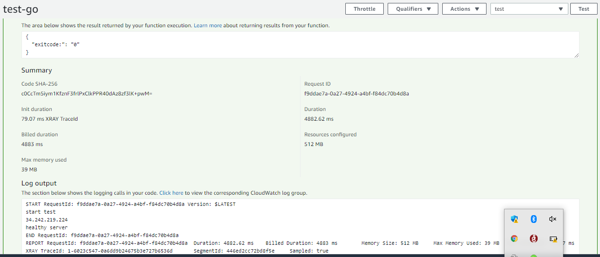

# **Health check Lambda**

check healthy server by Lambda function  

[**Requirement]()**

1. > **Package build**
   >
   > 1. GOOS=linux GOARCH=amd64 go build -o main 
   > 2. zip main.zip main 
   > 3. upload main.zip to Lambda Function code
   >
   > #### [**Running the tests]()**
   >
   > on Lambda create  configure test event
   >
   > with 
   >
   > {
   >   "host": "34.242.219.224"
   > }
   >
   > host is the server you  want to check health

return json exitcode 0 it's  successful and healthy server 

exitcode 1 it's failed and not healthy server

